# Docker Exercise — VMs vs Containers & Networking 


**Goal:** Build and run a multi-container app, scale app containers, and observe networking & shared state. Understand how containers differ from VMs and how service-to-service networking works.

> **Your Name: Joel Abreu Cohen**

## Prereqs
- Docker Desktop (link on Canvas to download)


## Part A - Docker Set-up

1. To begin this exercise, both teammates should have downloaded `Docker Desktop` and installed it on their computers.
2. Download the zip file from Canvas with the docker files you will need for today's session. Make sure to unzip them and save them in a folder that you can easily locate (NOT your `Downloads` folder)
3. To verify that your `Docker` installation was successful, open up a terminal and run the following commands:
	- `docker --version`
	- `docker compose version`
4. Both commands should work.


**Question 1. What did each command give you as an output, and what does it mean?**
> Answer here:
> Docker version 28.1.1, build 4eba377327 - version of docker engine
> Docker Compose version v5.1.2 - version of the docker tool used to manage multiple containers 
## Part B — Docker Warm-up

In your same terminal run ```docker run --rm -it python:3.12-slim bash```

**Question 2. Describe what the command in part B.1 does.**
> Answer here: try to start a container from the specified python image, wheter is present in local registry or not. If it's not, it download it from docker registry and starts the container.

Now run the commands ```uname -r``` and ```cat /etc/os-release```.

**Question 3. What was the output for each command in B.2? What was the difference between them?.**
> Answer here: uname -r is the release version of my operating system  kernel. cat /etc/os-release provides identification data of the OS distribution runing on my container which is Debian.

You can now exit the docker bash by using `exit`
In your same terminal, run the following commands (one by one):

```
docker pull ubuntu:24.04
docker run --rm -it ubuntu:24.04 bash
uname -r           
cat /etc/os-release 
```

**Question 4. Describe the above commands and how are they different than the commands you ran for part Q3.**
> Answer here: first we pull the image from the docker registry, then we start a container from the downloaded image, then we check the OS's kernel version (which is the same since we are using linux), and then print the OS distribution date we are using (in this case is different because we are running the Ubuntu distribution instead of Debian.  

You can now exit bash by using `exit`


## Part C - Isolation processes and containers

Run the next command in your terminal:

```
docker run --rm ubuntu:24.04 bash -lc 'echo "PID 1:"; cat /proc/1/comm; echo "Visible PIDs:"; ls -d /proc/[0-9]* | head'
```

**Question 5. Describe what this command does and what output you obtain. Feel free to include a screenshot or copy-paste the output.**

*Hint: this [article](https://dev.to/kalkwst/understanding-process-isolation-in-docker-an-in-depth-look-at-pid-namespaces-2ehh) can help you understand question 5.*

> Answer here: starting a container from ubuntu:24.04 image, then executing echo commands to look for different process IDs being executed in the container. The first print output the most recently active process in the container. Then we use the ls to list visible processes. 

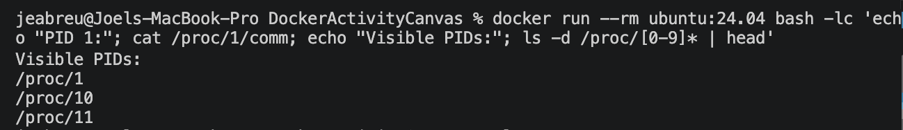

## Part D — Build the App

1. In your terminal navigate to the folder you downloaded and unzipped from Canvas
2. This folder has several files. Inspect and understand each file: `Dockerfile`, `app.py`, `requirements.txt`, `docker-compose.yml`, `nginx.conf`.

**Question 6: Describe what is the function of each file**
> Answer here: Dockerfile contains the specifications and instructions for docker to build an image for a Python application. app.py is the entrypoint or the application we are building the image for. requirements.txt is the libraries needed to build this application, docker-compose.yml is the manifest for the specifications (env variables, ports, images, etc) in order to run and start the services required for our app, such as redis, web server, and the API itself.     


Build the app:
	```
	docker compose build
	```
Run the previous command again

**Question 7: What happens if you run this command twice? What did you observe?**
> Answer here: it will take the cached build since there are no changes.

Now, let's run all the containers:
	```
	docker compose up
	```

Open up a new terminal and take a look at the response when you call the container:
```
curl localhost:8080
```

Go into the `app.py` file and change the `message`. Build the app again and take a look at the response message when you call the container.


**Question 8: what does the `curl` command do? Paste below and explain the output. What happens now that you've changed `app.py`?**
> Answer here: call the service exposed by 8080 port and get the new message in the service response since I changed the message before building the app again.

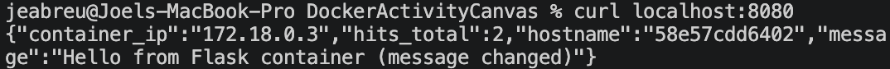


**Question 9: Without any modifications, predict what would happen if you changed `requirements.txt` and rerun the build? How is this different from Question 8? Do not actually modify your dependencies.**
> Answer here: it will failed since it would not meet the required dependencies to run the API. Is different because in question 8 I've changed the API content but not its dependencies.


Exciting time! You are now going to run your app (one app replica + redis + nginx):

```
docker compose up
```

Leave this terminal running and use a second terminal for subsequent commands.

In a web browser, go to: `http://localhost:8080/`. Your output will have the same fields, but the IP, hostname, greeting, and counter will vary. For example:
```
{"container_ip":"172.19.0.3","hits_total":1,"hostname":"<container-id>","message":"Hello from Flask container"}
```

**Question 10: What happens if you refresh your web browser from part D.7? Try it at least three time. Include screenshots in your answer.**
> Answer here: the total hits will increased by each request.

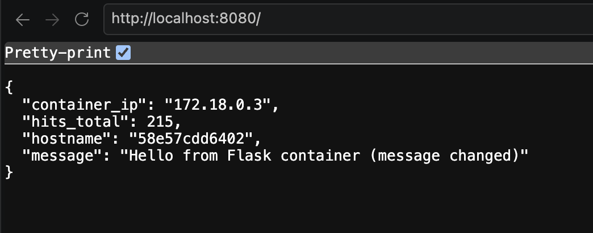
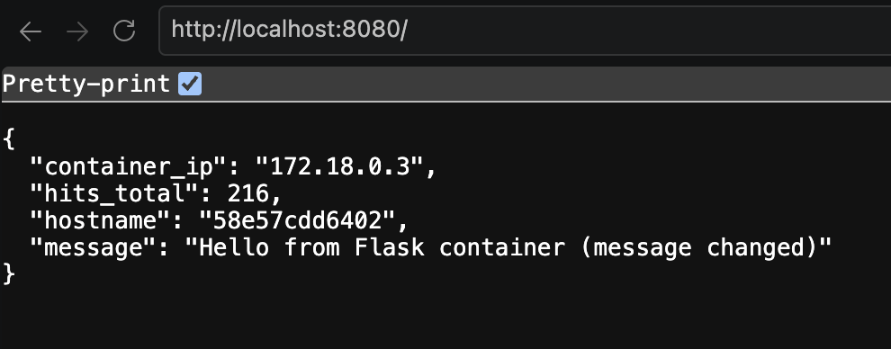
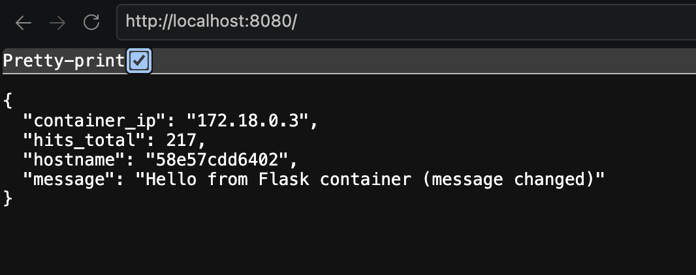


## Part E — Scale the App

Keep the container running in first terminal. Open a second terminal in the same folder and scale to three web replicas:
```bash
docker compose up -d --scale web=3
docker compose ps
```

Test it out with the web browser `http://localhost:8080/`

**Question 11: What do you see in your terminal vs your web browser? Add screenshots to your answer.**
> Answer here: in my terminal there are 3 replicas of the same app running, but in my browser I'm calling the same application with the same URL:PORT.

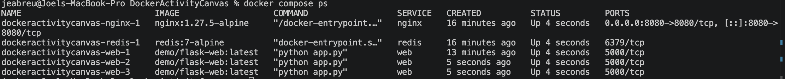


**Question 12: What happens to the container IP when hitting the endpoint multiple times? Paste examples of what you are opserving.**
> Answer here: it may vary based on the container replica that received the request.

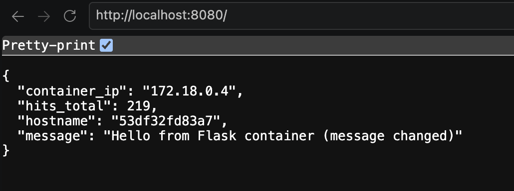
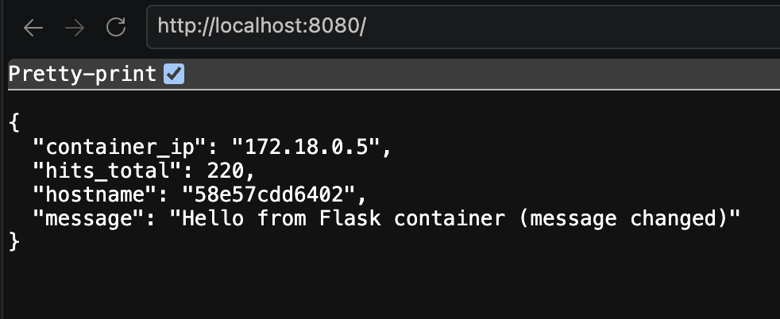
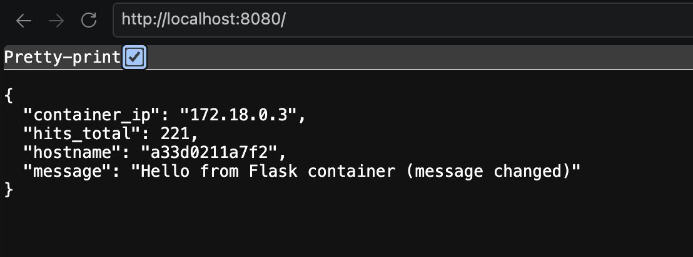

**Question 13: What did you just build?**
> Answer here: the same API with 3 replicas.


**Question 14: Without killing the terminal with your containers, execute the following command in your 2nd terminal::**

```
docker ps --format "table {{.Names}}	{{.Image}} {{.Ports}}"
```
> Attack a screenshot of your results here:

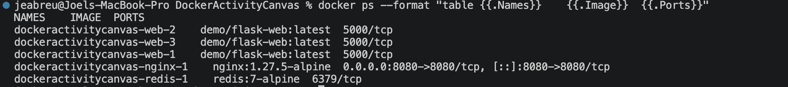


**Question 15: How does the app know the IP of the redis container?**
> Answer here: they are on the same network.


**Question 16: How does it know the port for redis? **
> Answer here: it's hardcoded in the API


## Part F — Investigate the Docker network

Docker Compose created a private network; its name ends in `_appnet` and begins with your project folder name.

Run `docker network ls`. Find the network ending in `_appnet`.

**Question 17.a.What is your project's network name and network ID?**
> Answer here: fd0724c19fda   dockeractivitycanvas_appnet

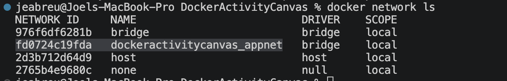


**Question 17.b. Run `docker network inspect <network-name>` after replacing the placeholder with your network's actual name. Locate `Subnet`, `Gateway`, and container `IPv4Address` entries for all running. Addresses differ between computers (and networks). Outline all your IPs below and describe what you observed.**
> Answer here: each container has an IPv4Address within the subnet.

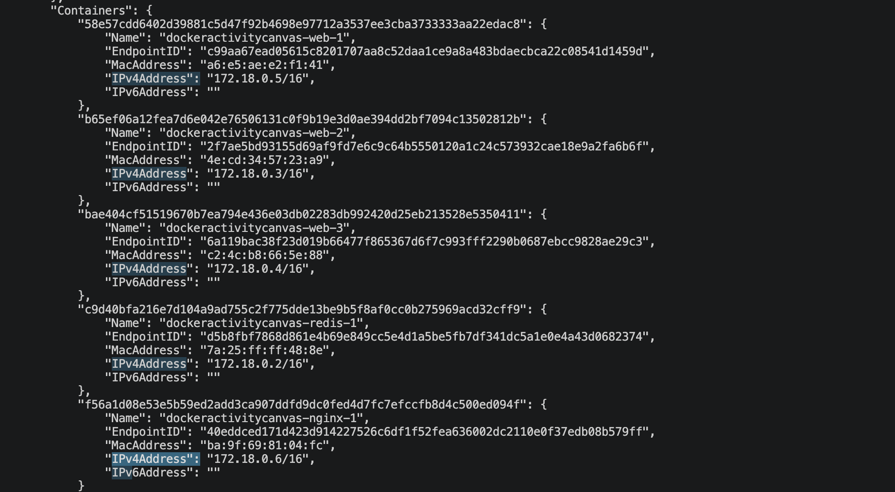


**Question 18. What subnet and gateway did Docker assign? What does the CIDR suffix (such as `/16`) mean?**
> Answer here: there are 16 available bits for different IP addresses within last 2 segments of the network.

"Subnet": "172.18.0.0/16",
"Gateway": "172.18.0.1"


 **Question 19. List the web, nginx, and Redis containers and their private IPs. Can a computer elsewhere on the Internet directly reach those IPs? Why?**
> Answer here: they can't because they are under the private network.

redis=172.18.0.2/16
ngnix=172.18.0.6/16
web=172.18.0.4/16

## Part G — Test service DNS 

Docker provides service names because container IPs can change. In the second terminal, run:

```bash
docker compose exec web getent hosts redis
docker compose exec web getent hosts web
```

`exec` runs a command inside an existing container. `run` starts a new one.

**Question 20. Compare the Redis DNS result with Question 19. Why might `web` return multiple IP addresses?**

> Answer and screenshot here: because web has 3 replicas. Each container has an individual IP addresses assigned.

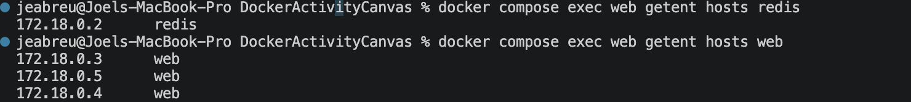

**Question 21. Why does `app.py` use the name `redis` rather than an IP? How does `docker compose exec` differ from `docker run`?**

> Answer here: because the IP may change by re-deployment or replica, meanwhile hostname still the same. docker compose exec execute a comment in an existing container or service is i while docker run starts a new container.


## Part H — Change a published port

The supplied configuration maps `8080:8080`: **computer port:nginx container port**. Nginx forwards to `web:5000` internally.

Edit only the nginx `ports` mapping in `docker-compose.yml` from `"8080:8080"` to `"9090:8080"`. Save. Do not change `nginx.conf`.
Stop the previous docker containers and run again the following commands (in seperate terminals):

```bash
docker compose up --scale web=3
docker compose ps
```

**Question 22.a. Try `http://localhost:9090/`, then `http://localhost:8080/`. The old port should fail unless another program uses it.**
> Include a screenshot: only 9090 works.

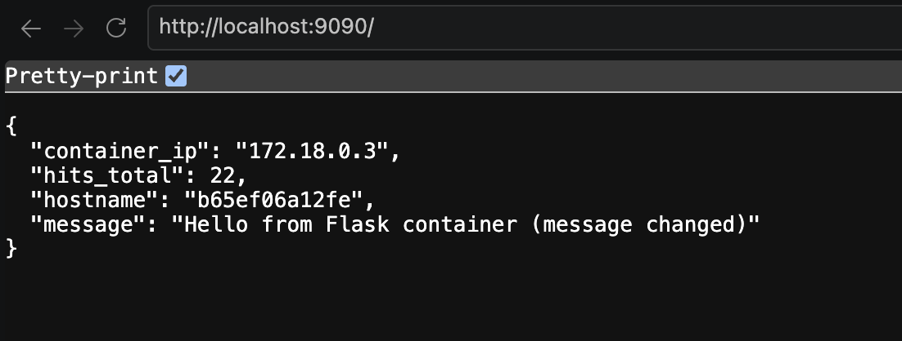
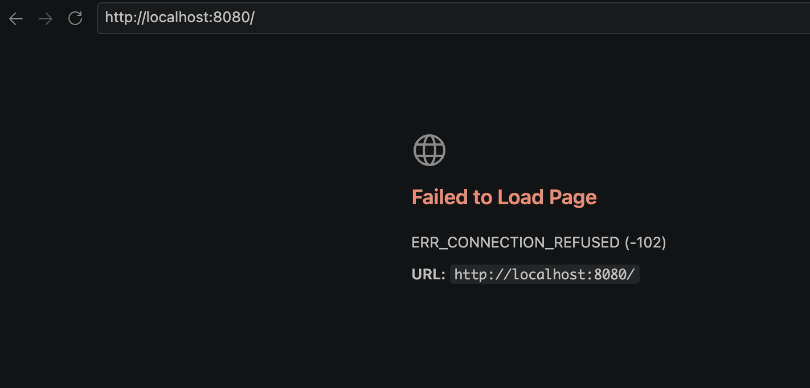

**Question 22.b. What happened at each URL? What port mapping does `docker compose ps` display?**
> Answer here: Only localhost:9090 threw a succesfull response, because the services has 9090 as listening port. docker compose ps display the exposed port and the internal port of the docker service. 


**Question 23. Did nginx's listening port change? Trace a request from your computer through nginx to a web replica. Explain what commends you used to know this.**
> Answer here: Yes it changed to 9090. I've used docker logs -f container-name to trace logs from each service. This command shows the full log of a give container or service.

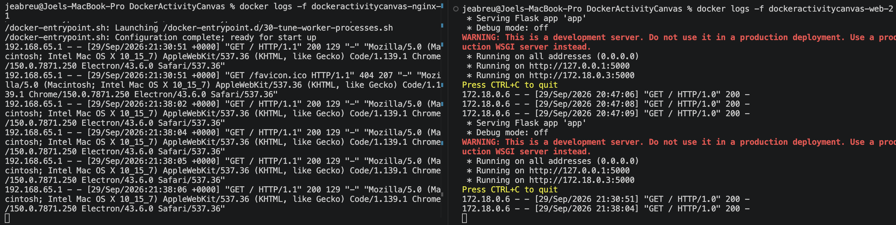


## Part I — Failure and recovery 

**Question 24. Run `docker compose ps` and choose the name of **one web replica**. Run `docker stop <web-container-name>` with that actual name. Wait about five seconds, then refresh `http://localhost:9090/` several times. If a request briefly fails, retry and record it.**

> Screenshots here:

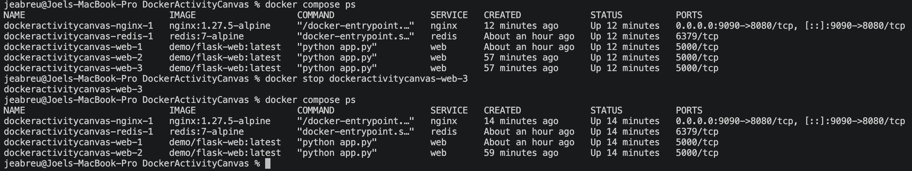
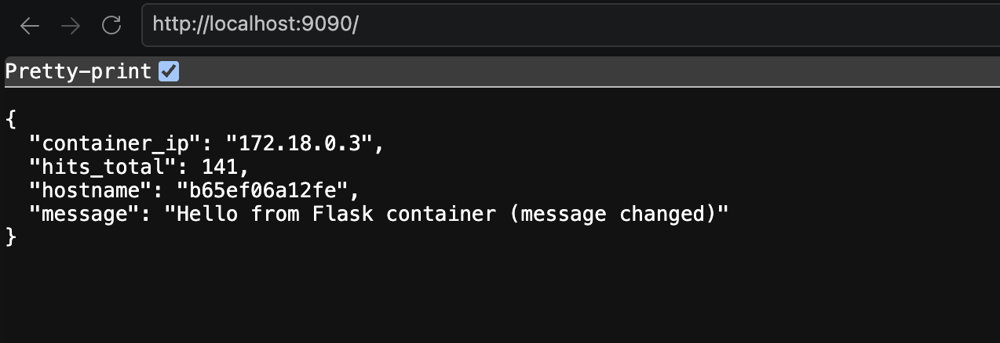
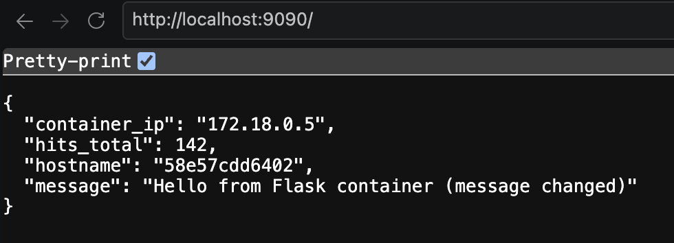


**Question 25. Does the app still work? How many replicas remain? Which component chooses a web replica?**
> Answer here: Yes it does. There are 2 replicas remaining. The ngnix. 


Find Redis with `docker compose ps -a`, then run `docker stop <redis-container-name>`. Try both `http://localhost:9090/` and `http://localhost:9090/health`.

**Question 26. What happens to `/` and `/health`? Use `app.py` to explain why the two routes behave differently..**
> Answer here: / route answers with a 500 Internal Server Error HTTP Status because it request redis to count the hits, in order to fulfill the request. Meanwhile /health answer with a 200 OK HTTP Status because it doesn't use redis to fulfill the request, it just needs the service to be up and running. 

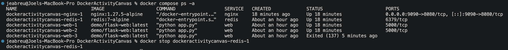
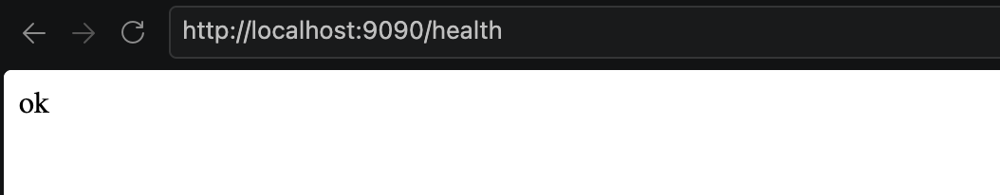
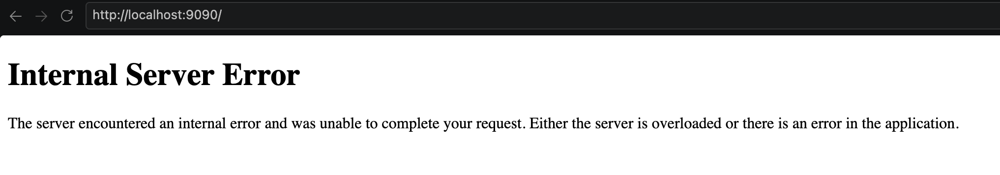


**Question 27. Compare losing one web replica with losing Redis. Which other component is a single point of failure in this setup?**
> Answer here: Losing a web replica doesn't affect the functionality of the application, unless we lose all the container instances. However, losing redis affects directly one of the application routes, because is part of one of the service's operations.


Restore the stack by running `docker compose up -d --scale web=3`. If Redis remains stopped, run `docker compose start redis`. Confirm that `http://localhost:9090/` works again.

**Question 27. Did the shared hit counter retain its value? What happens to Redis data if its container is recreated? Look for a Redis volume in the Compose file.**
> Answer here: Yes the counter retain its value. As I could see in the logs, the data is being backed up from last version of RDB from previeous container. When I did docker inspect redis-container-id I found that there's a default mount binding from /var/lib/docker/volumnes to /data (container's directory), which means the redis image take the available docker default volume and bind internally to the default /data directory.

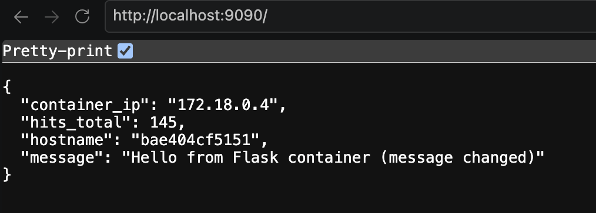


## Part J — Cloud and virtualization reflection 

**Question 28. Complete this table using the cloud computing concepts we have discussed. Describe the type of resource that could play each role; you do not need to know product or service names.**

> Fill out the table below:

| Component in our Docker app| Similar csource in a cloud deployment | Public or private? |
|---|---|---|
| Docker network |private network |private|
| nginx |gateway |private |
| Three web replicas |subnet | private | 
| Redis |subnet | private |
| Laptop compute |client |  private|


**Question 29. Imagine your application suddenly receives many more requests. You increase the web service from three to five replicas, but leave nginx and Redis unchanged. What part of the system gains capacity? Which components could still limit the application or cause an outage? Use observations from your scaling and failure experiments to explain.**

> Answer here: the /health endpoint would give a 200 OK response since the application layer is up and running. The bottleneck would be present in the proxy/web server and database layer. That could lead to 2 possible errors:
>- 502 proxy error because the current instance of ngnix is not able to receive more requests
> - 500 Internal Server Error for / route since redis current instance would not be able to fullfil the requests from the client

**Question 30. Someone says, “Containers are just small virtual machines.” Explain what this misses about kernels, process isolation, networking, and Docker Desktop's Linux VM. Cite one observation from this activity.**

> Answer here: Container are a limited form of virtualization with the necessary resources such as libraries, networks, OS, volumes needed to start a service or application. Containers sits on top of the Docker Engine's VM. Each container has its own isolated network, OS and processes, and specific configurations based on the image from it's started. While a VM needs a Hipervisor to manage and allocate the resources from the infraestructure, containers share the host operating system kernel, thus reducing one abstraction layer.
> 
> In the Part C of this activity it's shown how containers manage their own isolated processes, only visible for the given instance.     


## Part K — Cleanup
In the second terminal, run `docker compose down` from the activity folder. This removes the project containers and network. If the first terminal remains attached, press **Ctrl+C** there. The built image remains available.


## Part L — Share findings

- Submit this README with your answers to **CANVAS**, submit it both as a **Markdown and a PDF** document
- Be ready to share your findings with the class.
- Everyone in class will be asked to share findings


## References
Share any links that helped you through this exercise:


[https://dev.to/kalkwst/understanding-process-isolation-in-docker-an-in-depth-look-at-pid-namespaces-2ehh]
[https://northeastern.instructure.com/courses/260767/files/44378477?module_item_id=14675758]

